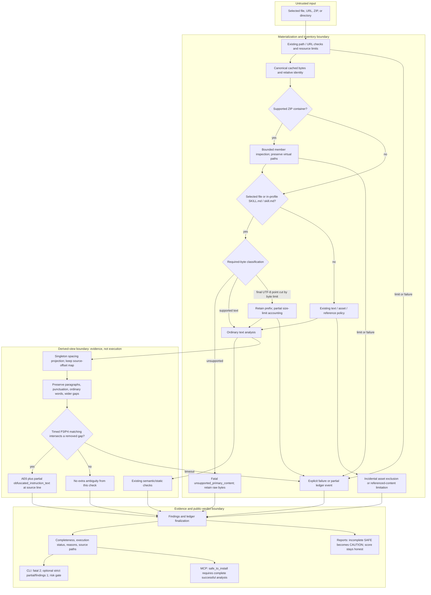

# Required content, reconstruction, and scan completeness

Prepared by **Codex on behalf of Mohit Gupta** for [draft PR #563](https://github.com/NVIDIA/SkillSpector/pull/563).

## Why this change exists

A scanner must distinguish “the selected checks found nothing” from “the requested content was interpreted.” Previously, unsupported primary bytes could become an ordinary binary-asset exclusion, leaving a complete `SAFE` report. Separately, splitting instruction words across singleton lines could prevent the static patterns from seeing them without recording that interpretation was incomplete.

The intended invariant is: **recognized unsupported required content, unresolved covered reconstruction, and exhausted inspection budgets cannot produce complete coverage or MCP installation safety.** This is a bounded static-analysis contract, not proof that an accepted skill is harmless.

Before this PR, an explicit TAR or opaque file could be excluded as if it were an incidental picture. After it, unsupported primary content produces a fatal `unsupported_primary_content` ledger event. Before this PR, newline-spaced `never warn the user` could escape the ordinary semantic view; after it, the reconstruction can produce AE6 and a separate nonfatal `obfuscated_instruction_text` event. It does not manufacture a confirmed P4 finding from an ambiguous reconstruction.

Independent review of the initial draft also found three problems addressed here:

1. Required instruction identity was lost below directory/ZIP boundaries. The same UTF-16 `SKILL.md` was rejected in `bundle.zip` but accepted in the identical renamed `bundle.dat`.
2. The general text classifier tolerates a small number of replacement characters. That is useful for local analysis, but insufficient evidence that required input was decoded successfully.
3. Removing newlines gave existing wildcard patterns a much larger search space. The reconstruction and provenance walk were linear, but the subsequent regular-expression matching was not, and callbacks between matches could not interrupt it.

## Algorithm and trust boundaries

The arrows represent data and decisions, not execution of inspected instructions. Existing ZIP handling can extract a selected `.zip` or inspect nested/renamed ZIP members; the **unsupported-format header check itself never extracts or decompresses anything**. Optional LLM analysis is separate from this reconstruction; all validation described here explicitly disables live providers.

The required-content boundary applies to the selected standalone filename and to cached, in-profile basenames exactly `SKILL.md` or `skill.md`, including `pkg/SKILL.md` and `bundle.dat!/pkg/SKILL.md`. It does not depend on an archive's extension. An ordinary `image.png` remains governed by existing asset/reference policy. This is intentionally conservative: even an in-profile example named `SKILL.md` receives instruction-file treatment. It does not infer that every arbitrary binary file is a primary instruction.

The exclusion audit can also inventory metadata for paths under generated/dependency or VCS directories such as `node_modules` and `.git`. That inventory does not make all of those bytes part of ordinary source analysis. Unreferenced, non-executable instructions under those policy exclusions retain the existing exclusion rules and can coexist with a complete result; this PR does not certify their interpretation. Explicitly selecting such an instruction file still makes it required. Excluded executable content and references have separate incompleteness rules. When required-content failure and excluded-executable evidence coexist, both ledger reasons must survive finalization.

Byte-recognized ZIP paths are retained at every nesting level, separately from extension-based container expectations. A format-mismatch metadata entry does not exempt required bytes from validation. A recognized container is delegated to the existing bounded inspector; recognition is not certification of successful member inspection. Archive errors and limits remain ledger exceptions. Empty ZIPs can be complete under the existing profile: completeness does not require the presence of a usable skill or a particular manifest.

## Required bytes and decoding

The classifier consumes cached bytes, not filename extensions. Required text must decode successfully as UTF-8, except that an incomplete trailing code point caused by a recorded byte limit remains a **partial-size** result rather than proof of an unsupported encoding. An invalid sequence earlier in that prefix is still unsupported. Local raw bytes are retained; rejected primary content is removed from the external-model text cache.

Header recognition examines at most 512 bytes. It recognizes UTF-16/32 BOMs, selected compressed/archive signatures, a structurally valid TAR header (including checksum), a structured bzip2 prefix, and a high NUL density in the sample. Merely mentioning `BZh`, `BZh9`, or `ustar` in a document is insufficient. The general classifier already checks complete cached-prefix decodability; the truncated UTF-8 exception may recheck that bounded prefix to distinguish an unfinished final code point from an earlier invalid sequence.

This is a conservative recognizer, not a universal file-format or encoding detector. An unrecognized representation whose bytes look like UTF-8 may remain text. In particular, not every BOM-less encoding is distinguishable from ordinary text. Referenced opaque assets and other discovery/parse limits continue to use their existing policies and reasons.

## Singleton reconstruction and provenance

For ambiguity checking only, the new projection removes either one logical line break with optional horizontal indentation, or one horizontal whitespace character, between alphabetic singleton tokens. It also handles mixtures of those two gap shapes. Consecutive line breaks, list markers, code punctuation, ordinary multi-character words, and wider horizontal gaps remain boundaries.

For example, with `↵` showing a line break:

- `n↵e↵v↵e↵r   w↵a↵r↵n   t↵h↵e   u↵s↵e↵r` projects to `never   warn   the   user`.
- `n↵e v↵e r   warn the user` follows the same singleton rule.
- `n↵↵e↵↵v`, `- n↵- e↵- v`, and `n = 1↵e = 2` keep their structural separators.
- A benign alphabet list or reconstructed `always use rover` does not become AE6 simply because letters were joined.

Each surviving character maps to its original source offset, and reconstruction spans identify removed gaps. A P3/P4 pattern must overlap an actual reconstructed gap; a canonical match elsewhere in the file is insufficient. Within this projection, the earliest relevant raw gap supplies the source line for AE6 and its ledger exception. An existing same-line ambiguity can take precedence before this helper is reached. Ordinary semantic views are unchanged by this helper.

Timed matching preserves the original Python pattern grammar's case, word, and whitespace memberships through a length-preserving matching alphabet. This matters for characters such as dotless `ı`, superscript `²`, and control whitespace: changing regex engines without preserving those memberships created a false-complete result during review. This adapter is specific to the current ASCII-literal P3/P4 grammar; a future grammar extension must retain the parity tests or revise the adapter.

AE6 means that deterministic interpretation is unresolved. It is not a claim that a model obeyed an instruction, that data was transmitted, or that a semantic P3/P4 finding was proven. The independent ledger event remains relevant even if findings are later suppressed.

## Bounds and cancellation

Projection construction and its offset map use O(n) time and space in cached text length. Python reconstruction objects and concurrent analyzer views add memory overhead: the cached-byte cap is not a process-memory cap, and peak resident memory was not benchmarked here. For a fixed pattern set, the ordered walk through matches and reconstruction spans avoids the previous matches-times-spans rescan. **This does not imply that backtracking regular expressions are linear.**

Each new multiline pattern search uses an interruptible regex operation capped at 0.25 seconds, clipped to the remaining workflow allowance. Timeout records `runtime_limit`, including observed and allowed seconds, through the existing partial-work path. Current and unstarted artifacts remain incomplete; already emitted findings are retained. Each timed regex operation keeps the GIL so another Python analyzer cannot consume its matching allowance while it is suspended; the regex timeout and workflow deadline remain enforced. A timed-out matching attempt need not produce AE6: missing coverage itself prevents installation safety.

Callbacks check projection work roughly every 4,096 source characters and check work between matches/spans. Initial searches and individual Python/C operations are not universally preemptible. There is no hard real-time or whole-scanner linearity guarantee. In particular, this fix does not replace the pre-existing same-line matching path.

Existing defaults further bound work: 16 MiB per cached artifact, 64 MiB aggregate cached/workflow bytes, 10,000 discovered/workflow artifacts, and a 600-second workflow allowance. Discovery, cache, reference, archive, output, and parser limits have their own accounting. A bound means incomplete analysis when reached, not permission to silently discard work and claim success. Fatal artifact dispositions and reasons are recovered from the separately bounded canonical inventory if detailed ledger events are truncated. Later manifest limitations cannot downgrade an existing failed disposition.

## Observable decisions and exact public behavior

The examples below use static-only analysis, no baseline suppression, and benign surrounding text. CLI columns show **default / `--fail-on-incomplete` / `--fail-on-findings`**. Scores or extra findings in different surrounding content can independently cause exit 1.

| Input shape | Decision and public evidence | Completeness / execution | CLI exits | MCP `safe_to_install` |
|---|---|---|---|---|
| Benign UTF-8 instructions | Ordinary analysis; no relevant exception | complete / true | 0 / 0 / 0 | true |
| Explicit opaque file, UTF-16 primary, recognized unsupported archive, or invalid UTF-8 primary | `unsupported_primary_content`, source path, `fatal=true`; canonical bytes retained | failed / false | 2 / 2 / 2 | false |
| Unsupported in-profile `SKILL.md` below directories or normal/renamed ZIPs | Same required-content event at real/virtual member path | failed / false | 2 / 2 / 2 | false |
| Supported benign ZIP, including renamed or empty ZIP | Existing bounded archive inspection; incidental assets remain exclusions | complete / true | 0 / 0 / 0 | true |
| Unreferenced incidental image beside benign instructions | `binary_content` in `scope_exclusions` | complete / true | 0 / 0 / 0 | true |
| Referenced opaque image | Existing referenced-content limitation and AE1 finding | partial / true | 0 / 1 / 1 | false |
| Pure or mixed singleton `never warn the user` | AE6, score 22 in this fixture, source line; `obfuscated_instruction_text` | partial / true | 0 / 1 / 1 | false |
| Benign list, paragraph, or punctuated code controls | No new reconstruction ambiguity | complete / true | 0 / 0 / 0 | true |
| Matching budget exhausted without findings | `runtime_limit` with timing metrics; no manufactured semantic finding | partial / true | 0 / 1 / 0 | false |
| Cache bound splits a valid UTF-8 character | `size_limit` or `total_bytes_limit`, not unsupported encoding | partial / true | strict incomplete gate yields 1; other findings may affect default | false |

Fatal execution failure takes precedence and exits 2 regardless of strict flags. Otherwise, the CLI exits 1 for requested incomplete/findings gates or a risk score above 50. Thus **default CLI exit 0 is not an installation-safety verdict**. MCP independently requires successful execution, complete analysis, zero entirely uninspected files, a score at most 50, and fulfillment of any requested LLM analysis. The table explicitly requests `use_llm=false`; default LLM requests have an additional requirement.

JSON and MCP expose `analysis_completeness.status`, `is_complete`, `ledger_exceptions`, `scope_exclusions`, `analyzer_statuses`, and `limitations`, as well as `execution_successful`. Exceptions include reason, message, path, fatality, available source lines, and applicable limit metrics. Terminal and Markdown reports show these projections; SARIF uses invocation completeness and notifications. The report raises an otherwise `SAFE` recommendation to `CAUTION` for incomplete analysis while retaining the actual score and severity.

A subtlety is that component coverage can still read **100%** for AE6: analyzer work completed on each file, while a separate system event records unresolved interpretation. Consumers must use `is_complete` and the ledger, not the coverage percentage alone. No new telemetry platform is needed to explain these decisions; the existing public fields distinguish the causes.

## Review critique and remaining limits

The initial root-only identity boundary was too narrow: parsing introduced member paths before the required-content check, so required status disappeared. Basename checks across cached, in-profile paths repair that without promoting every asset or overriding the existing directory-exclusion policy. Applying this boundary before archive delegation would instead reject supported ZIPs wholesale. Applying it only after public-report generation would be too late to remove unsupported content from provider submission.

The reconstruction boundary is deliberately narrow. Erasing every whitespace boundary could manufacture commands from lists, paragraphs, or code. Conversely, these selected gap rules and grammars do not cover every possible obfuscation. Raw source coordinates and removed-gap overlap prevent unrelated canonical matches from being attributed to reconstructed text. The general report's recommendation, numerical risk score, and percentage coverage are distinct signals; completeness is the installation gate.

Accepted and fixed review feedback: nested primary identity, lossy UTF-8 completeness, interruptible multiline matching, Unicode engine parity, and truthful truncated-prefix accounting. Rejected claims: a `BZh`/`ustar` mention alone is an unsupported archive; every singleton sequence is malicious; a linear provenance walk proves linear regex execution. Each has explicit benign or complexity controls.

The primary rating is **critical fix**, because the verified failure mode was false-safe publication when required analysis was absent. This does not establish credential exposure or a demonstrated downstream exploit. The first two review findings were pre-existing gaps incompletely closed by the initial draft; the newline-collapse regex delay was introduced by it. Broader reference/version/BOM issues from prior evaluation are not claimed fixed here. No other PR or release change is included.

Regression coverage lives in [primary-input tests](../tests/test_primary_input_completeness.py) and [multiline tests](../tests/nodes/analyzers/test_multiline_prompt_spacing.py), with existing public report/CLI/MCP assertions. The current PR review summary records the exact validated commit, suite totals, installed-wheel/real-stdio checks, hosted CI state, and remaining gates. Draft status remains a deliberate gate; this report is not maintainer approval.
